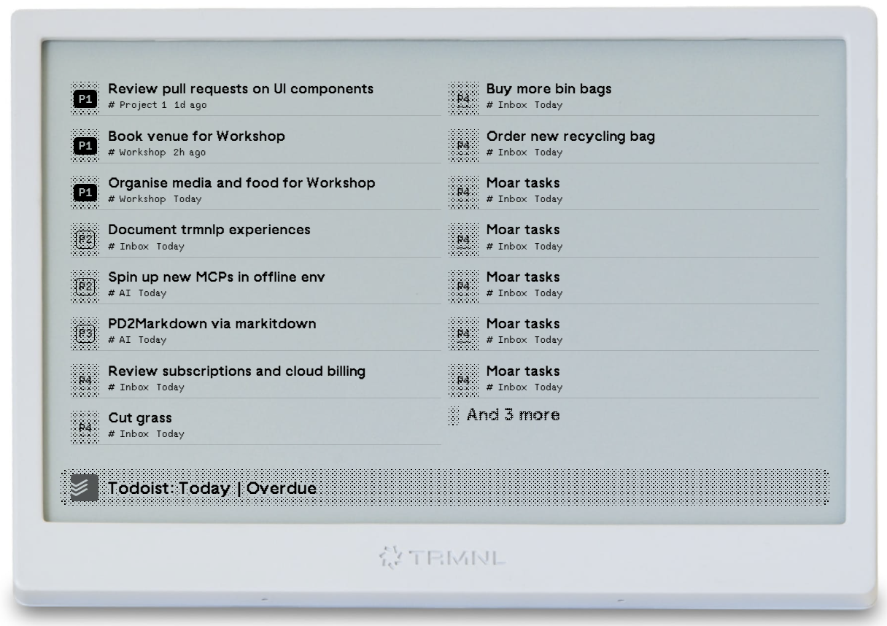

# TRMNL Todoist "Today" Plugin

## What is this?

This is a personal project relating to the [TRMNL](https://usetrmnl.com/) e-ink display, that proxies an authenticated connection to the Todoist API to fetches tasks using the filter `today | overdue`, before pushing that data to the TRMNL webhook for use in a private plugin.

> ℹ️ **Info:** This is the same filter shown on the native Todoist apps when you select the **Today** button. 
 
This repo contains the Private Plugin code (Liquid Markdown), and a python proxy script to hook your data up (run using cron on a rpi or something).

* Todoist data is collected (filer: `today | overdue`)
* Sorted by due date
* Sorted by priority
* Compacted a bit (given TRMNL has a 2KB limit)
* Pushed to the TRMNL servers via a webhook. 
 
This allows TRMNL to hold the data on their servers, and populate your private plugin using the TRMNL Markup.



## Skill level required to do this?

You'll need to be comfortable running python, getting keys from Todoist, and configuring TRMNL. 

* Medium spice: 🌶️🌶️

Hopefully the great team at TRMNL can improve the Native Todoist plugin to support the "Today" view.

> **Update 2025-05-14**: TRMNL native Todoist plugin now supports "Today" in the Project dropdown, but the default sort order is "Workspace".

## How is this repo laid out?

There are two main parts... the `proxy_layer` aspect which does the grunt work to connect and authenticate to Todoist, fix the data, and post it to the TRMNL webhook. 

And the `plugin` aspect, which holds the `.trmnlp.yml` file, and `bin` /  `src` directories required for local dev via the [https://github.com/usetrmnl/trmnlp](https://github.com/usetrmnl/trmnlp) project. This lets you run the plugin markup locally for development & testing.

You should see a structure *similar* to this on checking out this repo:

```
trmnl-todoist-today
├── .gitignore
├── Readme.md
├── example_full.png
├── plugin
│   ├── .trmnlp.yml
│   ├── bin
│   └── src
├── proxy_layer
│   ├── .env                            # You create this
│   ├── access_token.json               # PY creates this
│   ├── requirements.txt
│   ├── todoist-update-trmnl.py
│   └── venv                            # You manage this
└── test_code.py.old.py
```

## Get me started

### Step 1: Configure Todoist

You'll want to visit [https://developer.todoist.com/appconsole.html](https://developer.todoist.com/appconsole.html) and "Create a new app", and fill in the values as you please e.g.:

* App Name: "TRMNL"
* App service URL: "https://usetrmnl.com/" (optional)

You will then be presented with a **Client ID** and **Client secret**. Copy these into the `proxy_layer\.env` file (details below).

* Set OAuth redirect URL to: "http://localhost:8080/callback"
* Click "Save Settings"

### Step 2: Configure TRMNL

Log in to the TRMNL web console [https://usetrmnl.com/dashboard](https://usetrmnl.com/dashboard), select your device of choice from the top-right, and click the settings cog.

Scroll down to Developer Perks > Device Credentials > API Key, and note this.

Next, visit [https://usetrmnl.com/plugins](https://usetrmnl.com/plugins). Search for "Private Plugin", select it, and click "Add New".

* Give it a name... e.g. "Todoist Today"
* Refresh Rate... e.g. "Every 15 mins"
* Strategy = "webhook"

Copy the Plugin UUID from the right hand side too.

You'll want to add all of these values to your `proxy_layer\.env` file.

```
TODOIST_CLIENT_ID="abcdabcdabcdabcdabcdabcdabcdabcd"
TODOIST_CLIENT_SECRET="abcdabcdabcdabcdabcdabcdabcdabcd"
TRMNL_API_KEY="API_KEY_HERE"
TRMNL_PLUGIN_ID="Plugin_UUID_HERE"
```

### Step 3: Ensure python is installed and configured

````bash
$ cd proxy_layer

$ python --version       
Python 3.10.1

# Setup a virtual environment to hold our packages
$ python -m venv venv
$ .\venv\Scripts\activate       # for WINDOWS
$ . venv/bin/activate           # for LINUX
(venv) $ pip install -r requirements.txt
````

### Step 3: Run it for the first time

You should not see a cached `proxy_layer\access_token.json` file the first time you run this.

````bash
(venv) $ python todoist-update-trmnl.py

Starting TRMNL Todoist script
[>] Visit URL to authorize application: https://todoist.com/oauth/authorize?client_id=BLAH&scope=data%3Aread&state=BLAH
[+] Starting local server on http://localhost:8080
127.0.0.1 - - [14/May/2025 23:20:28] "GET /callback?code=XXXXX&state=YYYYY HTTP/1.1" 200 -
[<] OAuth Callback received: code=XXXX..., state=YYYY...
[*] Auth code and state stored in self_ref
[-] Local server shut down.
[>] Already authenticated to Todoist API.
[>] Access Token: abcd...
[>] Fetching Todoist data...
* [P1] Example Task 1 // Due: 2h ago // # Inbox
* [P1] Example Task 2 // Due: today // # Inbox
...
# Dump of JSON sent to TRMNL
...
[>] Tasks sent to TRMNL at 2025-05-14T23:20:30.461275
[>] Status: 200
[>] Message: None
````

If it looks something like that, TRMNL now has your JSON.

> Note that TRMNL webhooks are limited to 2kB. This code tries to trim the JSON array down to less than 2 kB.

### Step 4: Test it in trmnlp (optional)

If you like, you can test this code in trmnlp. I spun this up using a docker container, mounting the `plugin` directory. This means any changes to my `plugin\src\*.liquid` files, are automatically picked up.

```bash
$ cd trmnl-todoist-today
$ docker run -p 4567:4567 -v ./plugin:/plugin trmnl/trmnlp
```

Open your browser at http://localhost:4567/full when running.

To test with REAL data, you can take the JSON you generated above, convert that to YML using an online service, and replace the data in `plugin\.trmnlp.yml` under the `variables:` key.

### Step 5: Go live in TRMNL

Back in your private plugin view, you can select "Ediyt Markup" to paste in the following Liquid:

* `plugin\src\full.liquid` > Full
* `plugin\src\half_horizontal.liquid` > Half horizontal
* `plugin\src\half_vertical.liquid` > Half vertical
* `plugin\src\quadrant.liquid` > Quadrant

The "Your variables" section should show the data you just posted via the webhook. Save you changes.

You can now assign this plugin to your playlists.

### Step 6: Keep it running

I run `$ python todoist-update-trmnl.py` on an old Raspberry Pi. It runs on a CRON schedule every 15 mins to pull the todoist data, and push to TRMNL webhook.

````bash
$ git clone https://github.com/JK-ocx/trmnl-todoist-today.git
$ cd trmnl-todoist-today/proxy_layer/
$ python -m venv venv
$ . venv/bin/activate
$ python -m pip install -r requirements.txt

$ chmod +x todoist_trmnl.sh
$ ./todoist_trmnl.sh
# You may need to test on a dev box and copy over access_token.json if you don't have a browser to auth via
````

````bash
$ crontab -e

# Every 15 mins
*/15 * * * * /home/user/trmnl-todoist-today/proxy_layer/todoist_trmnl.sh >> /home/user/trmnl-todoist-today/proxy_layer/todoist_trmnl.log 2>&1
````

Works a treat for me...

